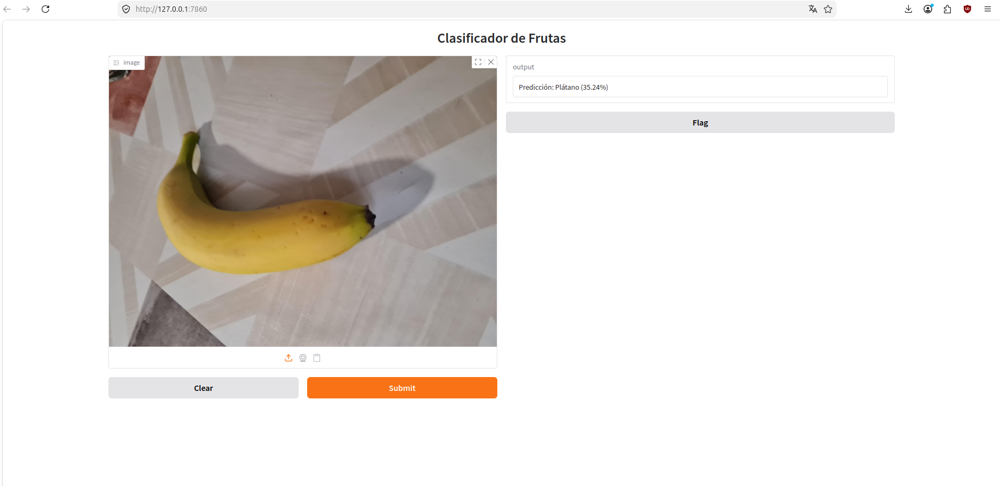
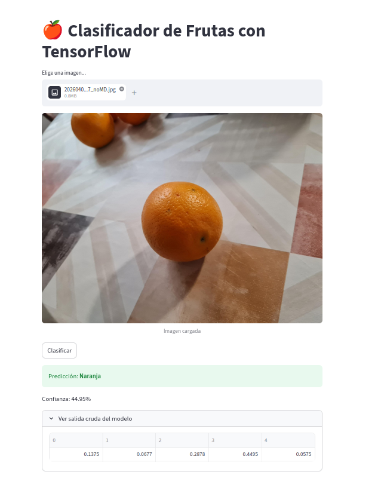

# WELCOME
This is an AI classifier which uses CNN architecture to classify differents types of fruits. 
This README only serve as an overview of this project. For a more detailed documentation, checkout
the [documentation directory](documentation), with versions in english and spanish.

# WHY CNN ARCHITECTURE?
In an era where transformers have taken over the AI industry, previous AI architectures can be seen
as stone age technology, however, I must argue that that doesn't make other architectures useless.

Think it in this way: If there is a single boulder in the middle of a road, and need to brake it first
to transport and process it, whould you bring an entire tunnel excavator? Transformers aren't cheap,
so it comes to a "bring the right tool to solve the specific problem, not a silver bullet one".

CNNs are pretty good catching independent and short distance data relations. Which is already what we need
to classify a single fruit in a picture. And CNNs are cheaper, images with lower resoluation and a few 
convoluational and normal/dense layers can be enough to get good results in minutes of training instaed of
hours.

# PROJECT ARCHITECTURE
The project is separated in three main modules or components:
- model_training: Tells in detail the training process, including an analisis of problems found during training
and posible solutions.
- flask_server: Contains a server.py and a client.py scripts to mount a simple client-server application.

- streamlit_app: Contains a streamlit_app.py script to mount the app in an streamlit environment or platform.

# WANT THE DATASET?
As explained in the [Notice file](./NOTICE.md), under the given conditions, you can download and use the dataset
as you want. But I must warn you that not all the images are different fruit individuals. A few numbers of fruits
were photographed, only changing the angle or scenary to increase the dataset. Don't ask me how to differentiate
or set appart the individuals, I don't know neither since it wasn't my intention.

# SEE ALSO
- [Notice file](NOTICE.md)